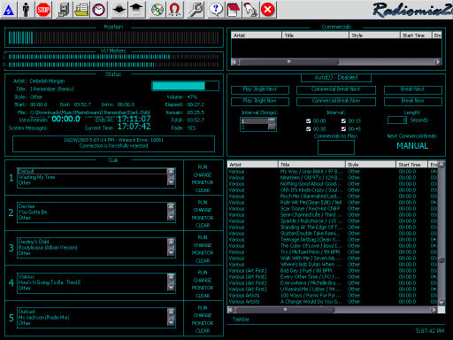

<div align="center">

## Radiomix2000


</div>

### Description

This is the new standard in radio automation software. Radiomix2000 has been in production for about 3 years now. I have been working on it off and on. Though it is far from complete, this is just an Alpha version and it works rather well. Current features include: Automatic mode, Manual mode, Individual song cue times and volumes, AGC (Automatic Gain Control), Silence Detection (immediatly cues next song upon detection of abnormal silence), Auto Import MP3 and WAV files, Playlist creation, Genre and Playlist Scheduling, Database management, User Access Control, Multiple Soundcard support (for monitoring and editing), Jingles (short sound bytes played between songs), Commercials, Voice Overs (song specific voice byte), MP3 to WAV Converter, and WAV to MP3 Converter (using LAME engine) and much more...

Features currently integrated, but disabled for bug fixes: Listener Request Webserver (built-in webserver for listener interaction), Remote Control (for mobile administrators or conveniance if running multiple stations on multiple computers. Features in development: CD Ripper, Voice Recording (for better integration of Voice Overs), Color Schemes and other GUI improvements for customization.

Because I have used 3rd part OCX's PlanetSourceCode will not let me upload the source code here, therefore, you must download it from my website at Yahoo/Geocities:

http://www.geocities.com/deejross If you would like to help me with production of the program (more features, bug fixing, better GUI, build a help file), have any questions, comments, or need to report bugs please let me know. You can also visit my website.
 
### More Info
 


<span>             |<span>
---                |---
**Submitted On**   |
**By**             |[Ross Peoples](https://github.com/Planet-Source-Code/PSCIndex/blob/master/ByAuthor/ross-peoples.md)
**Level**          |Advanced
**User Rating**    |4.8 (19 globes from 4 users)
**Compatibility**  |VB 6\.0
**Category**       |[Sound/MP3](https://github.com/Planet-Source-Code/PSCIndex/blob/master/ByCategory/sound-mp3__1-45.md)
**World**          |[Visual Basic](https://github.com/Planet-Source-Code/PSCIndex/blob/master/ByWorld/visual-basic.md)
**Archive File**   |[](https://github.com/Planet-Source-Code/ross-peoples-radiomix2000__1-49523/archive/master.zip)


### Source Code

```
http://www.geocities.com/deejross
The program uses DMC2. You can download it at
http://izzyonline.com/ftp/activex/Setup_DMC2_103.exe
```

